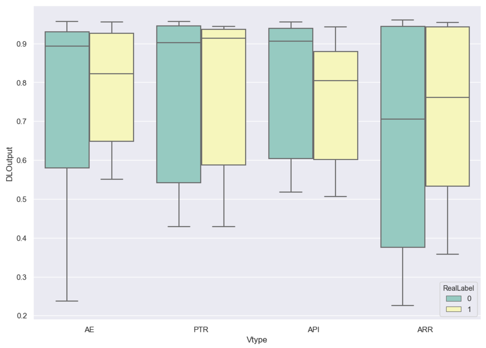
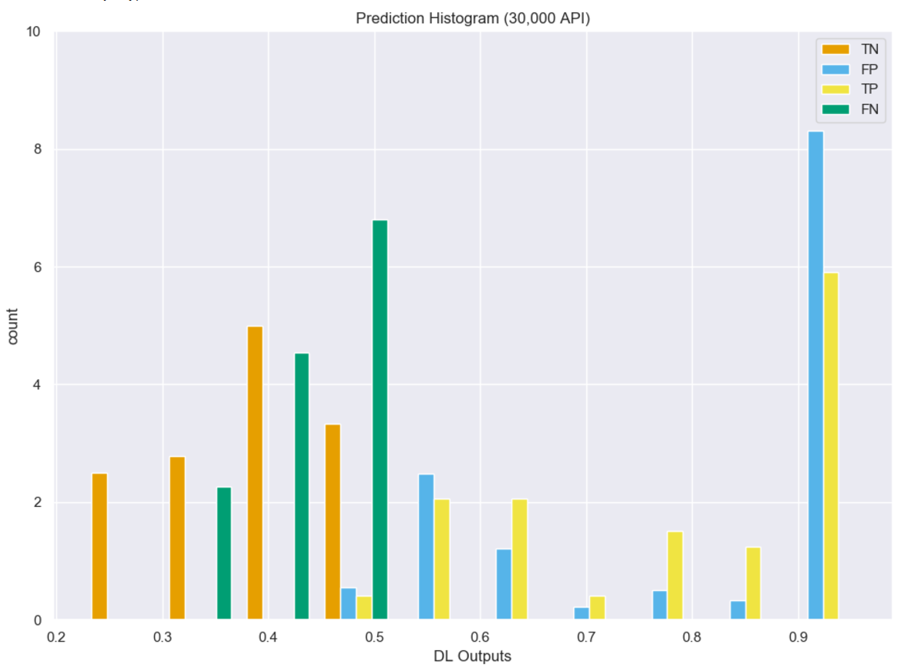
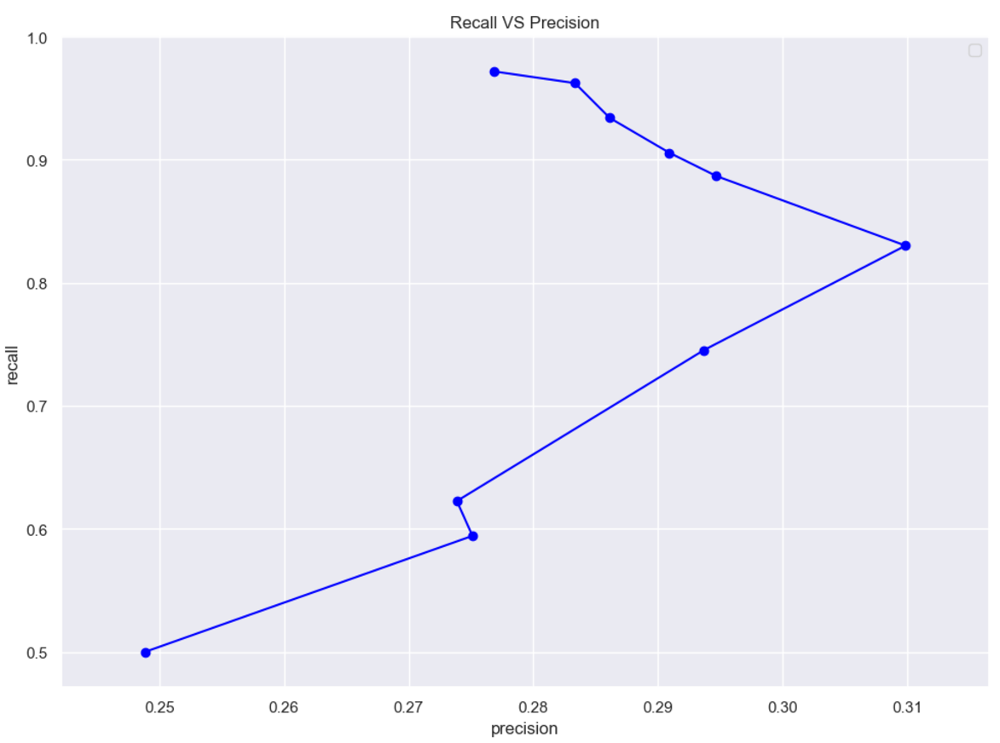
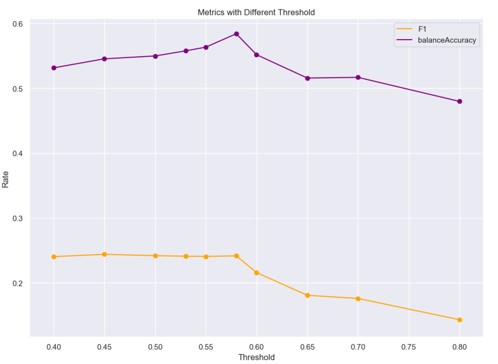
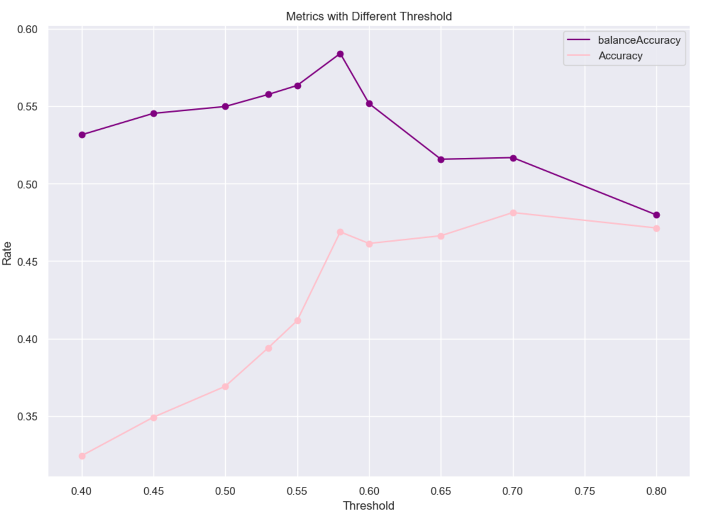
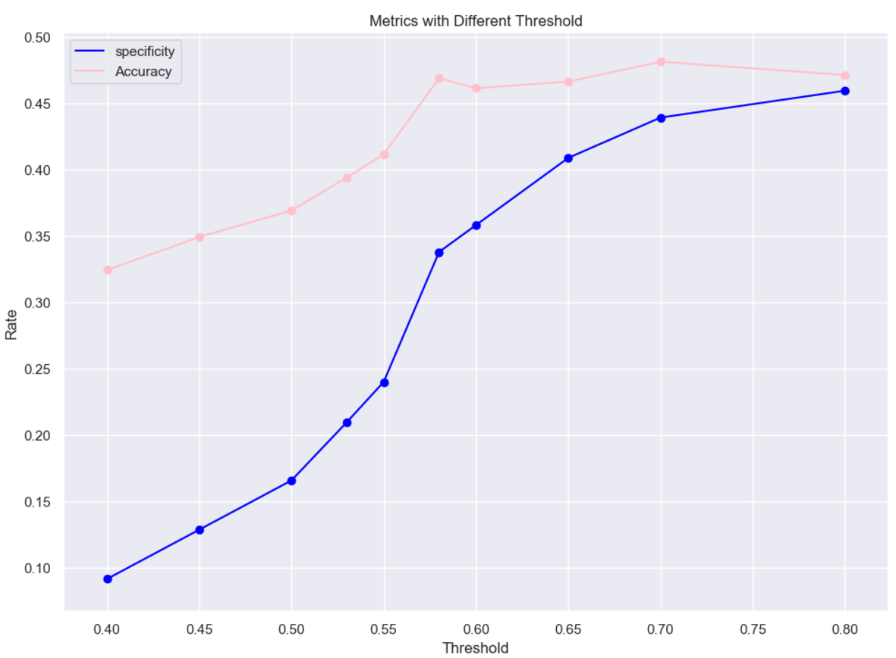

# Bidirectional Gated Recurrent Unit with ADAMAX:


## Training:
```
Build model...
Model: "sequential_1"
_________________________________________________________________
Layer (type)                 Output Shape              Param #   
=================================================================
masking_1 (Masking)          (None, 131, 30)           0         
_________________________________________________________________
bidirectional_1 (Bidirection (None, 131, 512)          440832    
_________________________________________________________________
dropout_1 (Dropout)          (None, 131, 512)          0         
_________________________________________________________________
bidirectional_2 (Bidirection (None, 512)               1181184   
_________________________________________________________________
dropout_2 (Dropout)          (None, 512)               0         
_________________________________________________________________
dense_1 (Dense)              (None, 1)                 513       
=================================================================
Total params: 1,622,529
Trainable params: 1,622,529
Non-trainable params: 0
_________________________________________________________________
Fit model with Trainning set...
DL_Final_balancedClassTrain.pkl
368 368
start
Epoch 1/10
11/11 [==============================] - 14s 1s/step - loss: 0.7838 - accuracy: 0.4886
Epoch 2/10
11/11 [==============================] - 11s 958ms/step - loss: 0.6885 - accuracy: 0.5284
Epoch 3/10
11/11 [==============================] - 11s 969ms/step - loss: 0.6830 - accuracy: 0.5369
Epoch 4/10
11/11 [==============================] - 11s 964ms/step - loss: 0.6784 - accuracy: 0.5625
Epoch 5/10
11/11 [==============================] - 11s 963ms/step - loss: 0.6770 - accuracy: 0.5710
Epoch 6/10
11/11 [==============================] - 11s 975ms/step - loss: 0.6725 - accuracy: 0.5994
Epoch 7/10
11/11 [==============================] - 11s 968ms/step - loss: 0.6704 - accuracy: 0.5710
Epoch 8/10
11/11 [==============================] - 11s 968ms/step - loss: 0.6675 - accuracy: 0.6250
Epoch 9/10
11/11 [==============================] - 11s 968ms/step - loss: 0.6608 - accuracy: 0.6080
Epoch 10/10
11/11 [==============================] - 11s 967ms/step - loss: 0.6564 - accuracy: 0.6278
```


## Model Predicitions:
```
Build model...
Model: "sequential_3"
_________________________________________________________________
Layer (type)                 Output Shape              Param #   
=================================================================
masking_3 (Masking)          (None, 131, 30)           0         
_________________________________________________________________
bidirectional_5 (Bidirection (None, 131, 512)          440832    
_________________________________________________________________
dropout_4 (Dropout)          (None, 131, 512)          0         
_________________________________________________________________
bidirectional_6 (Bidirection (None, 512)               1181184   
_________________________________________________________________
dropout_5 (Dropout)          (None, 512)               0         
_________________________________________________________________
dense_3 (Dense)              (None, 1)                 513       
=================================================================
Total params: 1,622,529
Trainable params: 1,622,529
Non-trainable params: 0
_________________________________________________________________
[0.7796447, 0.7487138, 0.5512497, 0.9091624, 0.49450392, 0.78175986, 0.8611624, 0.9212892, 0.9394165, 0.931624]
predicted array shape:  (400, 1)
new real label array shape:  (400, 1)
```


## Confusion Matrix:
```
Predicted Class
Total Samples 400.0
| Type     |   Positive |   Negative |
|----------+------------+------------|
| Positive |         99 |          6 |
| Negative |        246 |         49 |

Predicted Class
╒══════════╤════════════════════╤════════════════════╤═════════════════════╤═════════════╕
│          │ Positive           │ Negative           │ Rate                │             │
╞══════════╪════════════════════╪════════════════════╪═════════════════════╪═════════════╡
│ Positive │ 99.0               │ 6.0                │ 0.9428571462631226  │ Sensitivity │
├──────────┼────────────────────┼────────────────────┼─────────────────────┼─────────────┤
│ Negative │ 246.0              │ 49.0               │ 0.16610169410705566 │ specificity │
├──────────┼────────────────────┼────────────────────┼─────────────────────┼─────────────┤
│          │ 0.2869565188884735 │ 0.8909090757369995 │ 0.3700000047683716  │ Accuracy    │
├──────────┼────────────────────┼────────────────────┼─────────────────────┼─────────────┤
│          │ Precision          │ NegPrediction      │                     │             │
╘══════════╧════════════════════╧════════════════════╧═════════════════════╧═════════════╛
```


## Graphed Outputs:
### Distribution per CVE type


### Prediction distribution


### Recall Vs. Precision


### Accuracy Vs. F1 score


### Balanced Accuracy Vs. Accuracy



### Specificity Vs. Accuracy
