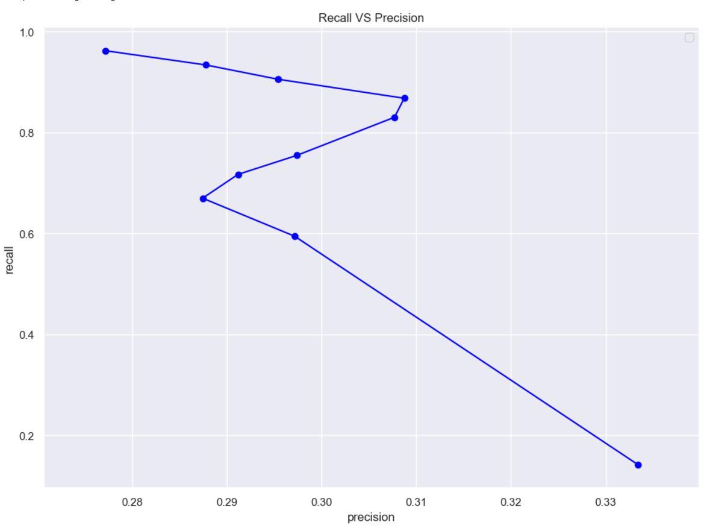
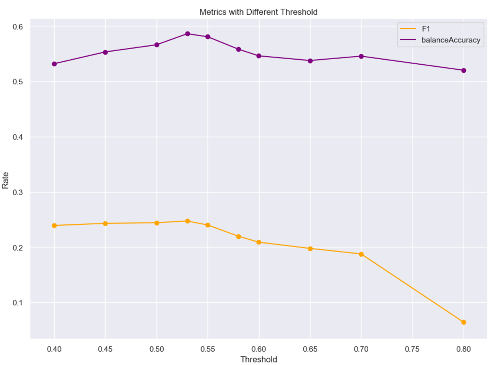
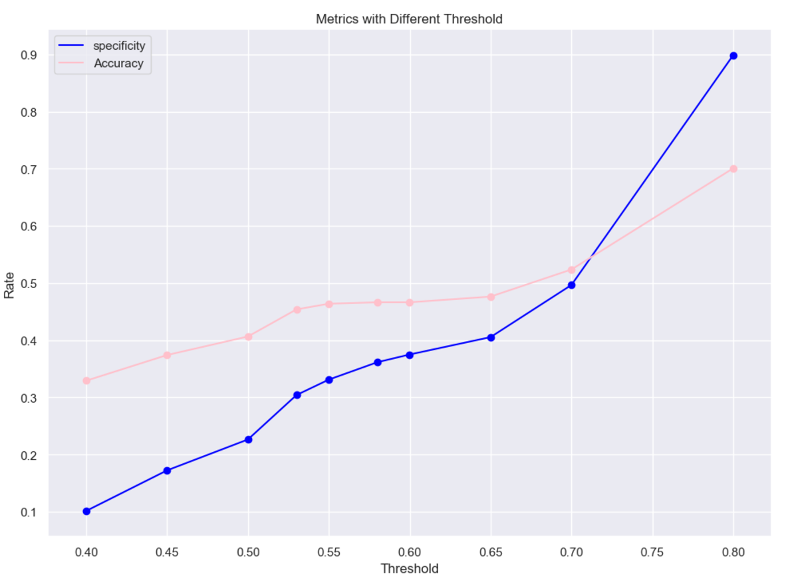

# Bidirectional Gated Recurrent Unit with ADAM:

## Training:
Build model...
Model: "sequential_1"
_________________________________________________________________
Layer (type)                 Output Shape              Param #   
=================================================================
masking_1 (Masking)          (None, 131, 30)           0         
_________________________________________________________________
bidirectional_1 (Bidirection (None, 131, 512)          440832    
_________________________________________________________________
dropout_1 (Dropout)          (None, 131, 512)          0         
_________________________________________________________________
bidirectional_2 (Bidirection (None, 512)               1181184   
_________________________________________________________________
dropout_2 (Dropout)          (None, 512)               0         
_________________________________________________________________
dense_1 (Dense)              (None, 1)                 513       
=================================================================
Total params: 1,622,529
Trainable params: 1,622,529
Non-trainable params: 0
_________________________________________________________________
Fit model with Trainning set...
DL_Final_balancedClassTrain.pkl
368 368
start
Epoch 1/10
11/11 [==============================] - 14s 1s/step - loss: 0.7231 - accuracy: 0.4716
Epoch 2/10
11/11 [==============================] - 11s 961ms/step - loss: 0.6856 - accuracy: 0.5312
Epoch 3/10
11/11 [==============================] - 11s 956ms/step - loss: 0.6835 - accuracy: 0.5284
Epoch 4/10
11/11 [==============================] - 11s 968ms/step - loss: 0.6781 - accuracy: 0.5426
Epoch 5/10
11/11 [==============================] - 11s 965ms/step - loss: 0.6809 - accuracy: 0.5767
Epoch 6/10
11/11 [==============================] - 11s 968ms/step - loss: 0.6689 - accuracy: 0.6051
Epoch 7/10
11/11 [==============================] - 11s 964ms/step - loss: 0.6665 - accuracy: 0.6278
Epoch 8/10
11/11 [==============================] - 11s 963ms/step - loss: 0.6613 - accuracy: 0.6051
Epoch 9/10
11/11 [==============================] - 11s 968ms/step - loss: 0.6613 - accuracy: 0.6193
Epoch 10/10
11/11 [==============================] - 11s 965ms/step - loss: 0.6471 - accuracy: 0.6136

## Model Predicitions:
Build model...
Model: "sequential_3"
_________________________________________________________________
Layer (type)                 Output Shape              Param #   
=================================================================
masking_3 (Masking)          (None, 131, 30)           0         
_________________________________________________________________
bidirectional_5 (Bidirection (None, 131, 512)          440832    
_________________________________________________________________
dropout_4 (Dropout)          (None, 131, 512)          0         
_________________________________________________________________
bidirectional_6 (Bidirection (None, 512)               1181184   
_________________________________________________________________
dropout_5 (Dropout)          (None, 512)               0         
_________________________________________________________________
dense_3 (Dense)              (None, 1)                 513       
=================================================================
Total params: 1,622,529
Trainable params: 1,622,529
Non-trainable params: 0
_________________________________________________________________
[0.78030163, 0.76705647, 0.5393088, 0.7975508, 0.43548337, 0.7397105, 0.9050149, 0.71786827, 0.8037153, 0.684277]
predicted array shape:  (400, 1)
new real label array shape:  (400, 1)

## Confusion Matrix:
Predicted Class
Total Samples 400.0
| Type     |   Positive |   Negative |
|----------+------------+------------|
| Positive |         96 |          9 |
| Negative |        228 |         67 |

Predicted Class
╒══════════╤═════════════════════╤════════════════════╤═════════════════════╤═════════════╕
│          │ Positive            │ Negative           │ Rate                │             │
╞══════════╪═════════════════════╪════════════════════╪═════════════════════╪═════════════╡
│ Positive │ 96.0                │ 9.0                │ 0.9142857193946838  │ Sensitivity │
├──────────┼─────────────────────┼────────────────────┼─────────────────────┼─────────────┤
│ Negative │ 228.0               │ 67.0               │ 0.22711864113807678 │ specificity │
├──────────┼─────────────────────┼────────────────────┼─────────────────────┼─────────────┤
│          │ 0.29629629850387573 │ 0.8815789222717285 │ 0.4074999988079071  │ Accuracy    │
├──────────┼─────────────────────┼────────────────────┼─────────────────────┼─────────────┤
│          │ Precision           │ NegPrediction      │                     │             │
╘══════════╧═════════════════════╧════════════════════╧═════════════════════╧═════════════╛

## Graphed Outputs:
### Distribution per CVE type

### Prediction distribution

### Recall Vs. Precision

### Accuracy Vs. F1 score

### Balanced Accuracy Vs. Accuracy

### Specificity Vs. Accuracy
