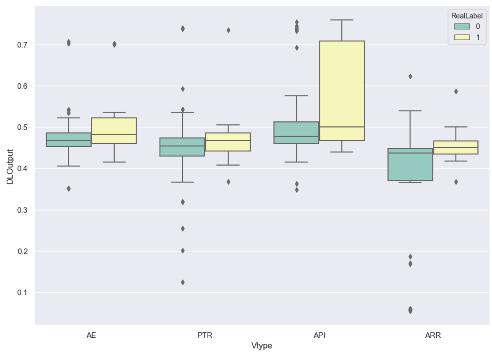
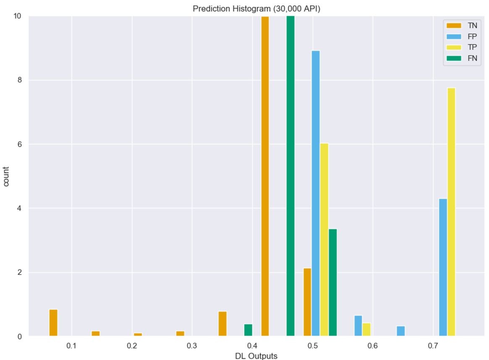
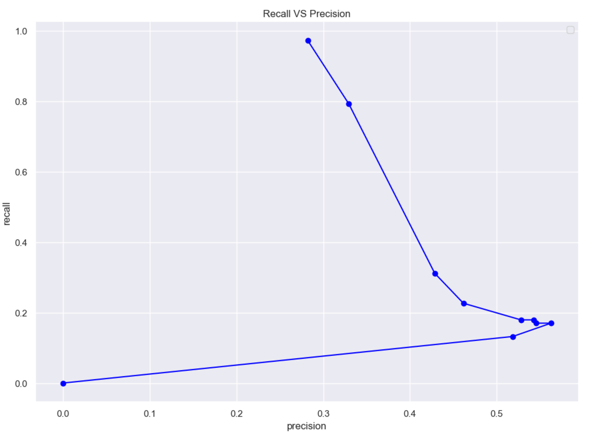
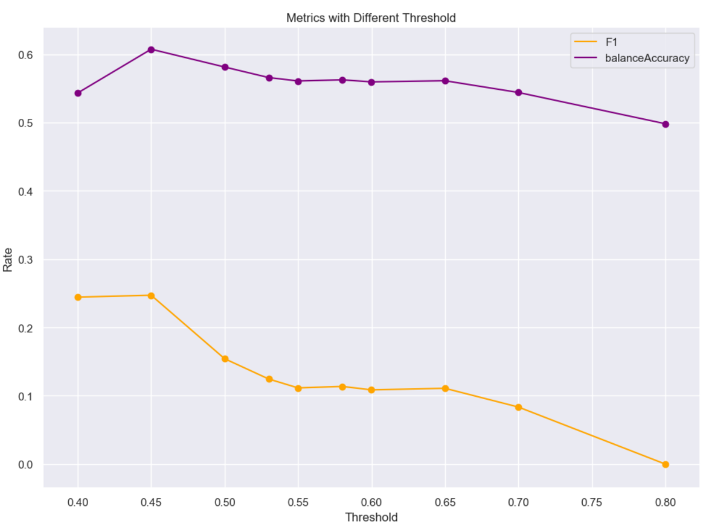
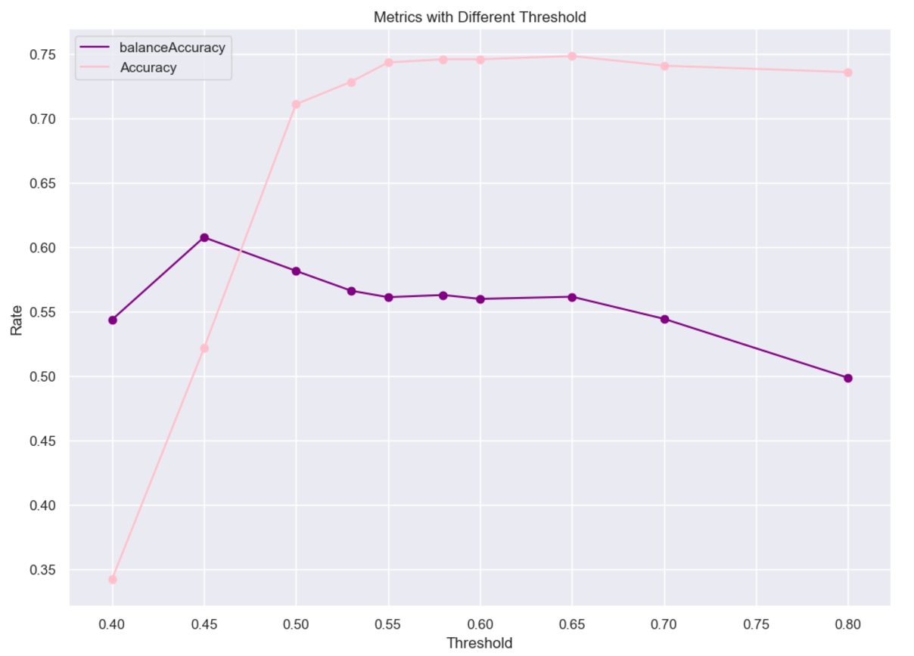
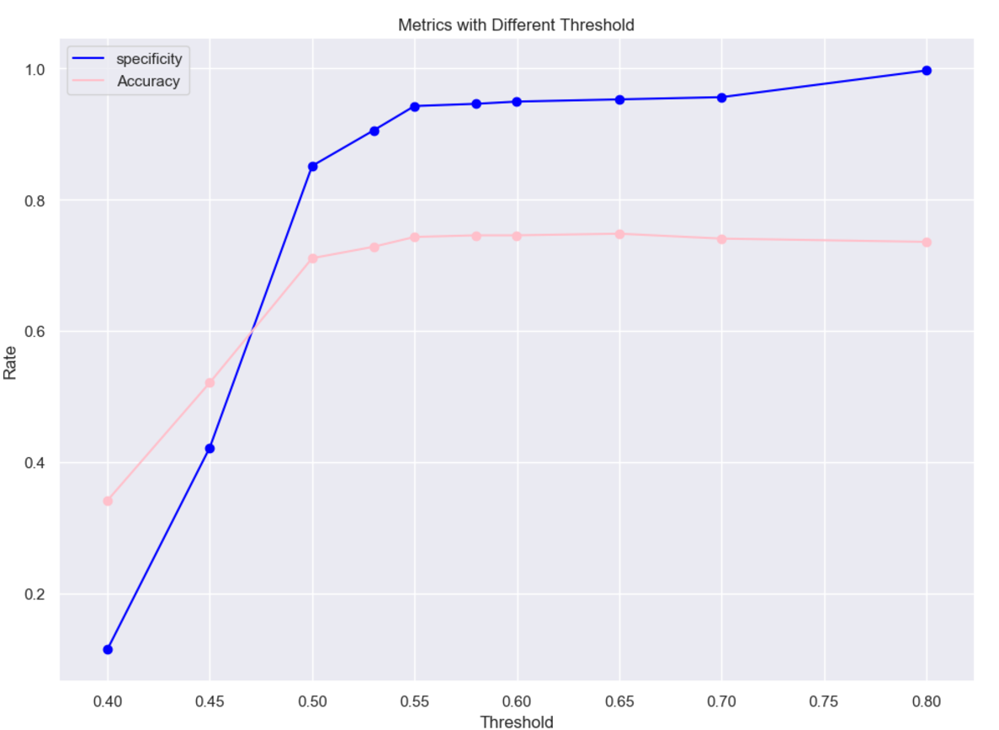

# Bidirectional Long Short-Term Memory with ADAMAX:
(Uses image-[6, 11])

## Training:
Build model...
Model: "sequential_2"
_________________________________________________________________
Layer (type)                 Output Shape              Param #   
=================================================================
masking_2 (Masking)          (None, 131, 30)           0         
_________________________________________________________________
bidirectional_3 (Bidirection (None, 131, 512)          587776    
_________________________________________________________________
bidirectional_4 (Bidirection (None, 512)               1181184   
_________________________________________________________________
dropout_2 (Dropout)          (None, 512)               0         
_________________________________________________________________
dense_2 (Dense)              (None, 1)                 513       
=================================================================
Total params: 1,769,473
Trainable params: 1,769,473
Non-trainable params: 0
_________________________________________________________________
Fit model with Trainning set...
DL_Final_balancedClassTrain.pkl
368 368
start
Epoch 1/10
11/11 [==============================] - 12s 1s/step - loss: 0.7561 - accuracy: 0.5057
Epoch 2/10
11/11 [==============================] - 10s 868ms/step - loss: 0.6904 - accuracy: 0.5426
Epoch 3/10
11/11 [==============================] - 10s 876ms/step - loss: 0.6884 - accuracy: 0.5710
Epoch 4/10
11/11 [==============================] - 10s 870ms/step - loss: 0.6834 - accuracy: 0.5795
Epoch 5/10
11/11 [==============================] - 9s 857ms/step - loss: 0.6736 - accuracy: 0.5994
Epoch 6/10
11/11 [==============================] - 10s 869ms/step - loss: 0.6915 - accuracy: 0.5994
Epoch 7/10
11/11 [==============================] - 10s 875ms/step - loss: 0.6751 - accuracy: 0.5341
Epoch 8/10
11/11 [==============================] - 10s 865ms/step - loss: 0.6584 - accuracy: 0.5938
Epoch 9/10
11/11 [==============================] - 9s 862ms/step - loss: 0.6536 - accuracy: 0.5994
Epoch 10/10
11/11 [==============================] - 10s 872ms/step - loss: 0.6448 - accuracy: 0.6051

## Model Predicitions:
Build model...
Model: "sequential_4"
_________________________________________________________________
Layer (type)                 Output Shape              Param #   
=================================================================
masking_4 (Masking)          (None, 131, 30)           0         
_________________________________________________________________
bidirectional_7 (Bidirection (None, 131, 512)          587776    
_________________________________________________________________
bidirectional_8 (Bidirection (None, 512)               1181184   
_________________________________________________________________
dropout_4 (Dropout)          (None, 512)               0         
_________________________________________________________________
dense_4 (Dense)              (None, 1)                 513       
=================================================================
Total params: 1,769,473
Trainable params: 1,769,473
Non-trainable params: 0
_________________________________________________________________
[0.70607466, 0.70153016, 0.47876346, 0.4820404, 0.47361037, 0.7370358, 0.7542049, 0.4814363, 0.44531453, 0.45587575]
predicted array shape:  (400, 1)
new real label array shape:  (400, 1)

## Confusion Matrix:
Predicted Class
Total Samples 400.0
| Type     |   Positive |   Negative |
|----------+------------+------------|
| Positive |         33 |         72 |
| Negative |         43 |        252 |

Predicted Class
╒══════════╤═════════════════════╤════════════════════╤════════════════════╤═════════════╕
│          │ Positive            │ Negative           │ Rate               │             │
╞══════════╪═════════════════════╪════════════════════╪════════════════════╪═════════════╡
│ Positive │ 33.0                │ 72.0               │ 0.3142857253551483 │ Sensitivity │
├──────────┼─────────────────────┼────────────────────┼────────────────────┼─────────────┤
│ Negative │ 43.0                │ 252.0              │ 0.8542372584342957 │ specificity │
├──────────┼─────────────────────┼────────────────────┼────────────────────┼─────────────┤
│          │ 0.43421053886413574 │ 0.7777777910232544 │ 0.7124999761581421 │ Accuracy    │
├──────────┼─────────────────────┼────────────────────┼────────────────────┼─────────────┤
│          │ Precision           │ NegPrediction      │                    │             │
╘══════════╧═════════════════════╧════════════════════╧════════════════════╧═════════════╛

## Graphed Outputs:
### Distribution per CVE type

### Prediction distribution

### Recall Vs. Precision

### Accuracy Vs. F1 score

### Balanced Accuracy Vs. Accuracy

### Specificity Vs. Accuracy
