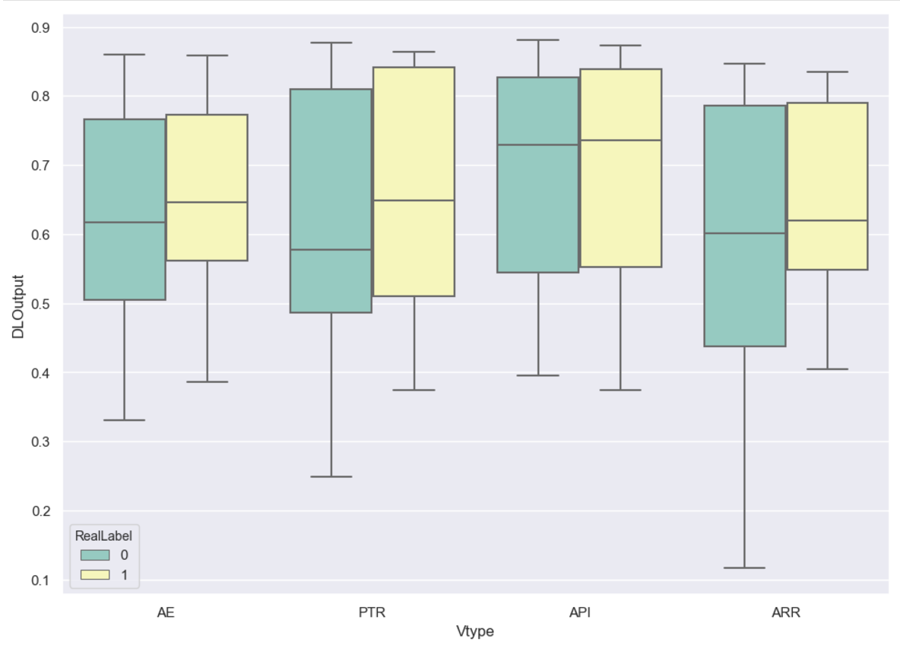
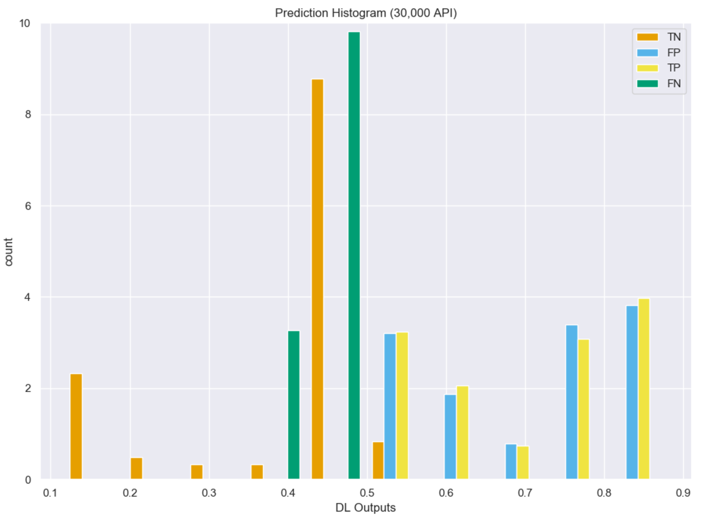
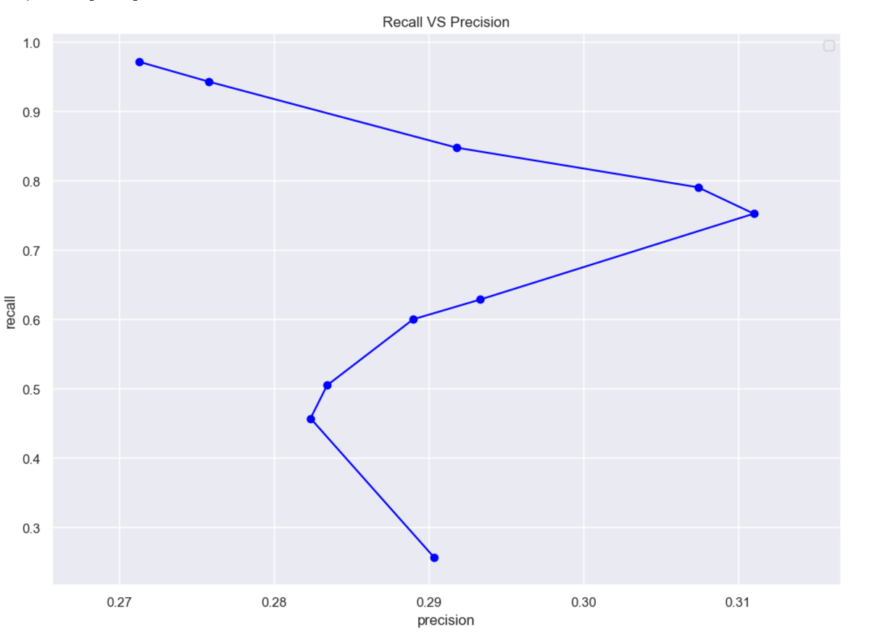
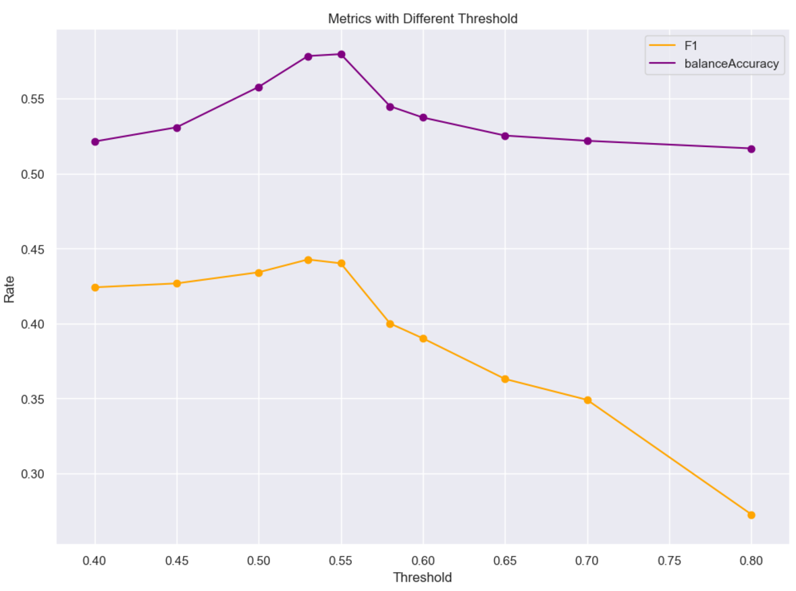
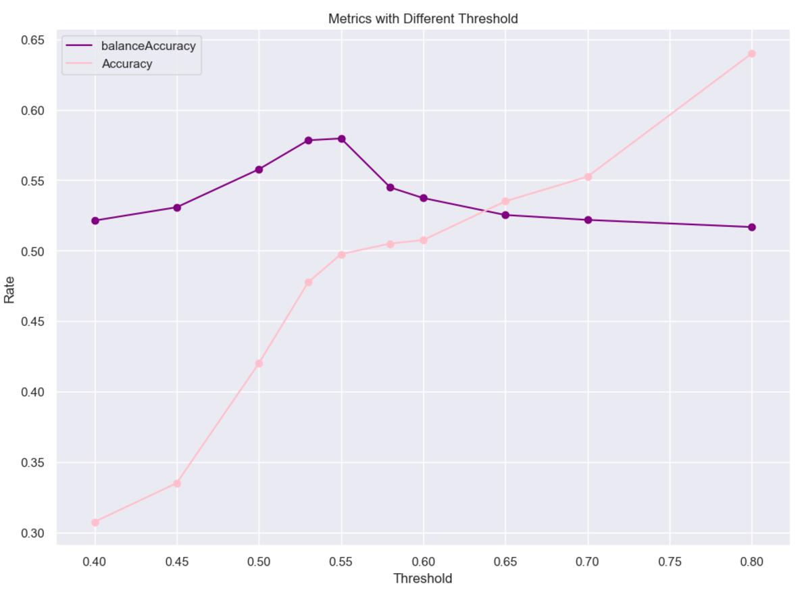
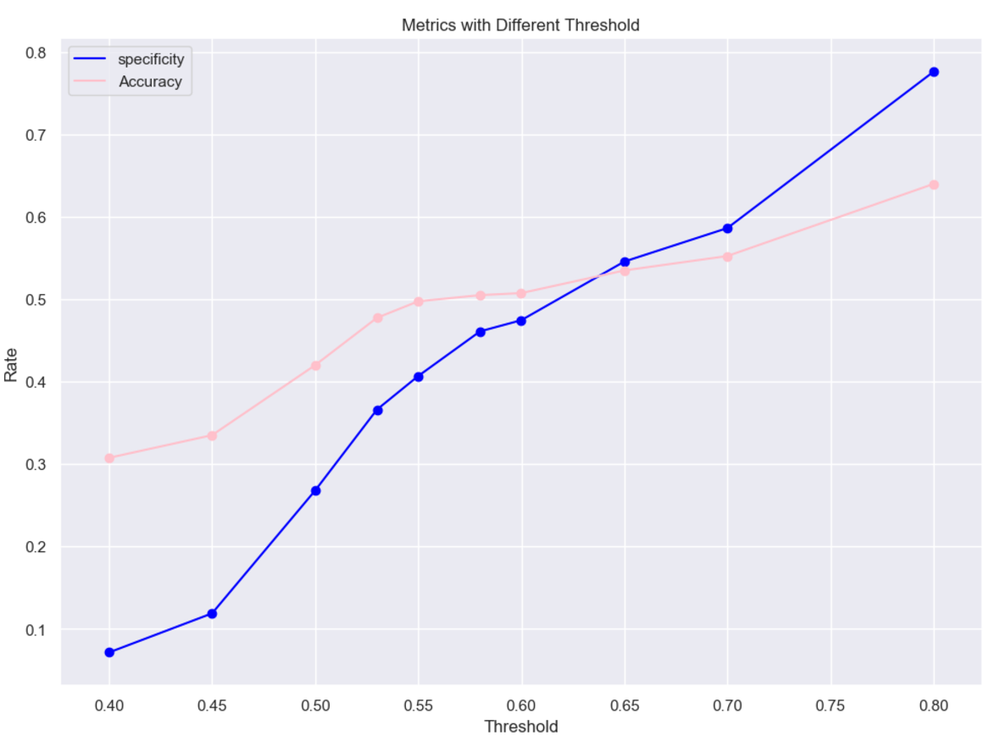

# Bidirectional Long Short-Term Memory with ADAM:
(Uses image-[0,6])

## Training:
```
Build model...
Model: "sequential_1"
_________________________________________________________________
Layer (type)                 Output Shape              Param #   
=================================================================
masking_1 (Masking)          (None, 131, 30)           0         
_________________________________________________________________
bidirectional_1 (Bidirection (None, 131, 512)          587776    
_________________________________________________________________
bidirectional_2 (Bidirection (None, 512)               1181184   
_________________________________________________________________
dropout_1 (Dropout)          (None, 512)               0         
_________________________________________________________________
dense_1 (Dense)              (None, 1)                 513       
=================================================================
Total params: 1,769,473
Trainable params: 1,769,473
Non-trainable params: 0
_________________________________________________________________
Fit model with Trainning set...
DL_Final_balancedClassTrain.pkl
368 368
start
Epoch 1/10
11/11 [==============================] - 13s 1s/step - loss: 0.7199 - accuracy: 0.4801
Epoch 2/10
11/11 [==============================] - 10s 893ms/step - loss: 0.6895 - accuracy: 0.5511
Epoch 3/10
11/11 [==============================] - 10s 896ms/step - loss: 0.6844 - accuracy: 0.5653
Epoch 4/10
11/11 [==============================] - 10s 896ms/step - loss: 0.6799 - accuracy: 0.5966
Epoch 5/10
11/11 [==============================] - 10s 881ms/step - loss: 0.6815 - accuracy: 0.5483
Epoch 6/10
11/11 [==============================] - 10s 872ms/step - loss: 0.6772 - accuracy: 0.5398
Epoch 7/10
11/11 [==============================] - 10s 883ms/step - loss: 0.6667 - accuracy: 0.6023
Epoch 8/10
11/11 [==============================] - 10s 875ms/step - loss: 0.6680 - accuracy: 0.5966
Epoch 9/10
11/11 [==============================] - 10s 884ms/step - loss: 0.6518 - accuracy: 0.6193
Epoch 10/10
11/11 [==============================] - 10s 873ms/step - loss: 0.6564 - accuracy: 0.6051
```


## Model Predicitions:
```
Build model...
Model: "sequential_3"
_________________________________________________________________
Layer (type)                 Output Shape              Param #   
=================================================================
masking_3 (Masking)          (None, 131, 30)           0         
_________________________________________________________________
bidirectional_5 (Bidirection (None, 131, 512)          587776    
_________________________________________________________________
bidirectional_6 (Bidirection (None, 512)               1181184   
_________________________________________________________________
dropout_3 (Dropout)          (None, 512)               0         
_________________________________________________________________
dense_3 (Dense)              (None, 1)                 513       
=================================================================
Total params: 1,769,473
Trainable params: 1,769,473
Non-trainable params: 0
_________________________________________________________________
[0.77522874, 0.7734939, 0.5242002, 0.8479819, 0.4857335, 0.7566609, 0.8380132, 0.85445607, 0.77069485, 0.51598006]
predicted array shape:  (400, 1)
new real label array shape:  (400, 1)
```


## Confusion Matrix:
```
Predicted Class
Total Samples 400.0
| Type     |   Positive |   Negative |
|----------+------------+------------|
| Positive |         89 |         16 |
| Negative |        216 |         79 |

Predicted Class
╒══════════╤════════════════════╤════════════════════╤═════════════════════╤═════════════╕
│          │ Positive           │ Negative           │ Rate                │             │
╞══════════╪════════════════════╪════════════════════╪═════════════════════╪═════════════╡
│ Positive │ 89.0               │ 16.0               │ 0.8476190567016602  │ Sensitivity │
├──────────┼────────────────────┼────────────────────┼─────────────────────┼─────────────┤
│ Negative │ 216.0              │ 79.0               │ 0.2677966058254242  │ specificity │
├──────────┼────────────────────┼────────────────────┼─────────────────────┼─────────────┤
│          │ 0.2918032705783844 │ 0.8315789699554443 │ 0.41999998688697815 │ Accuracy    │
├──────────┼────────────────────┼────────────────────┼─────────────────────┼─────────────┤
│          │ Precision          │ NegPrediction      │                     │             │
╘══════════╧════════════════════╧════════════════════╧═════════════════════╧═════════════╛
```


## Graphed Outputs:
### Distribution per CVE type


### Prediction distribution


### Recall Vs. Precision


### Accuracy Vs. F1 score


### Balanced Accuracy Vs. Accuracy


### Specificity Vs. Accuracy
