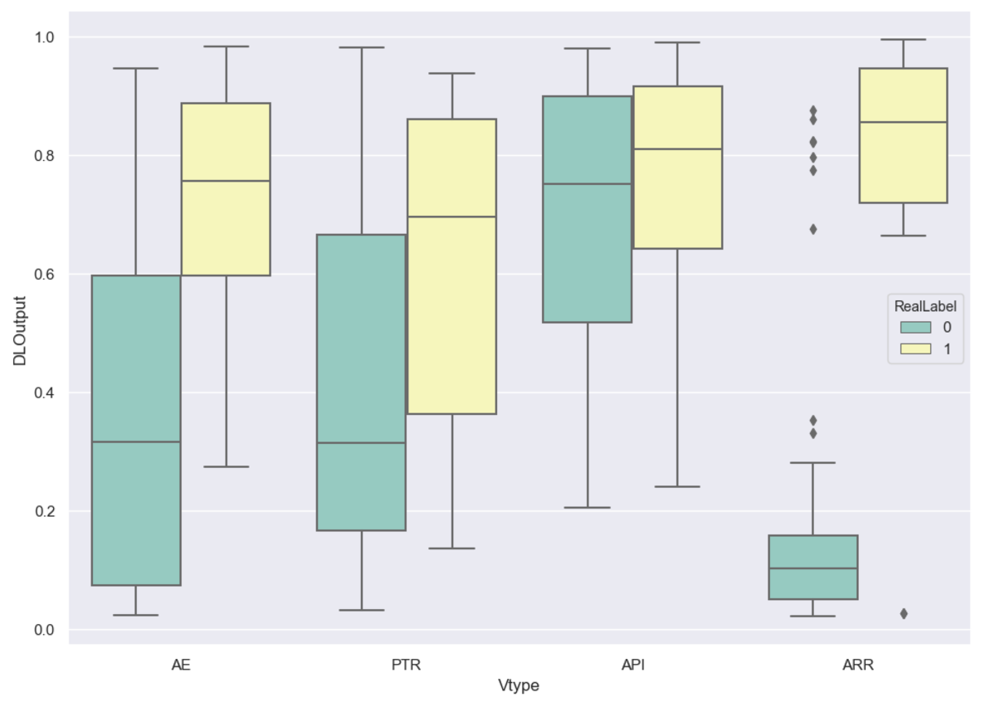
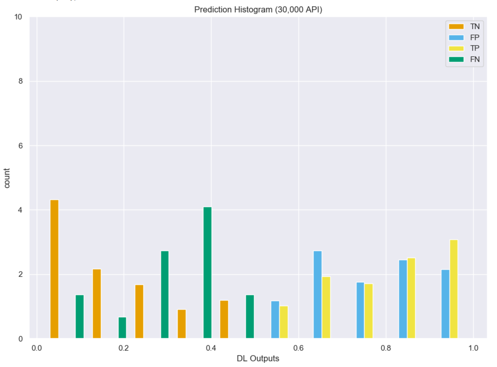
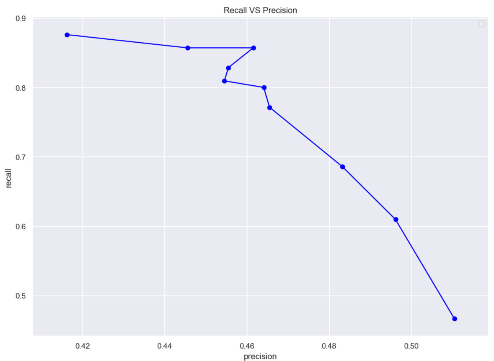
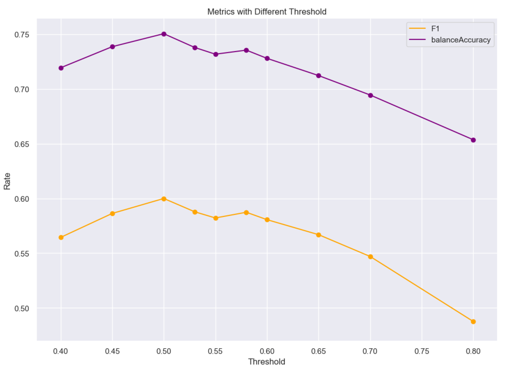
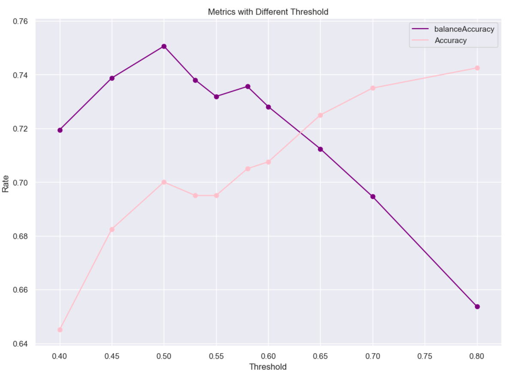
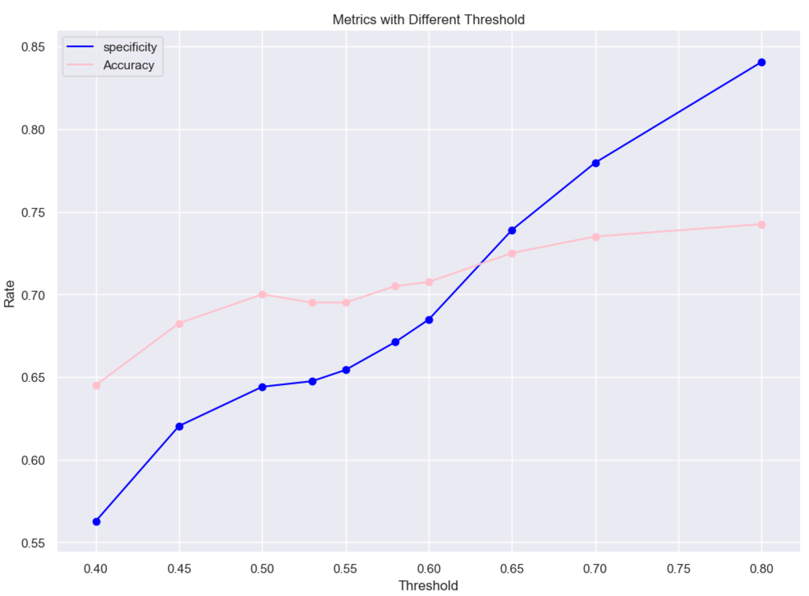

# Bidirectional Recurrent Neural Network with ADAMAX:
(Uses image-[7,12])

## Training:
```
Build model...
Model: "sequential_1"
_________________________________________________________________
Layer (type)                 Output Shape              Param #   
=================================================================
masking_1 (Masking)          (None, 131, 30)           0         
_________________________________________________________________
bidirectional_1 (Bidirection (None, 131, 512)          146944    
_________________________________________________________________
dropout_1 (Dropout)          (None, 131, 512)          0         
_________________________________________________________________
bidirectional_2 (Bidirection (None, 512)               1181184   
_________________________________________________________________
dropout_2 (Dropout)          (None, 512)               0         
_________________________________________________________________
dense_1 (Dense)              (None, 1)                 513       
=================================================================
Total params: 1,328,641
Trainable params: 1,328,641
Non-trainable params: 0
_________________________________________________________________
Fit model with Trainning set...
DL_Final_balancedClassTrain.pkl
368 368
start
Epoch 1/10
11/11 [==============================] - 10s 917ms/step - loss: 0.9755 - accuracy: 0.5057
Epoch 2/10
11/11 [==============================] - 8s 700ms/step - loss: 0.6991 - accuracy: 0.5426
Epoch 3/10
11/11 [==============================] - 8s 721ms/step - loss: 0.6459 - accuracy: 0.6449
Epoch 4/10
11/11 [==============================] - 8s 714ms/step - loss: 0.6217 - accuracy: 0.6676
Epoch 5/10
11/11 [==============================] - 8s 693ms/step - loss: 0.5727 - accuracy: 0.7301
Epoch 6/10
11/11 [==============================] - 9s 778ms/step - loss: 0.5369 - accuracy: 0.7216
Epoch 7/10
11/11 [==============================] - 8s 687ms/step - loss: 0.4938 - accuracy: 0.7585
Epoch 8/10
11/11 [==============================] - 8s 690ms/step - loss: 0.4809 - accuracy: 0.7727
Epoch 9/10
11/11 [==============================] - 8s 713ms/step - loss: 0.4257 - accuracy: 0.8182
Epoch 10/10
11/11 [==============================] - 8s 706ms/step - loss: 0.4477 - accuracy: 0.7869
```


## Model Predicitions:
```
Build model...
Model: "sequential_3"
_________________________________________________________________
Layer (type)                 Output Shape              Param #   
=================================================================
masking_3 (Masking)          (None, 131, 30)           0         
_________________________________________________________________
bidirectional_5 (Bidirection (None, 131, 512)          146944    
_________________________________________________________________
dropout_4 (Dropout)          (None, 131, 512)          0         
_________________________________________________________________
bidirectional_6 (Bidirection (None, 512)               1181184   
_________________________________________________________________
dropout_5 (Dropout)          (None, 512)               0         
_________________________________________________________________
dense_3 (Dense)              (None, 1)                 513       
=================================================================
Total params: 1,328,641
Trainable params: 1,328,641
Non-trainable params: 0
_________________________________________________________________
[0.59559715, 0.88777274, 0.031747553, 0.59559715, 0.30834484, 0.93221796, 0.9319544, 0.64929235, 0.027564345, 0.1354993]
predicted array shape:  (400, 1)
new real label array shape:  (400, 1)
```


## Confusion Matrix:
```
Predicted Class
Total Samples 400.0
| Type     |   Positive |   Negative |
|----------+------------+------------|
| Positive |         90 |         15 |
| Negative |        105 |        190 |

Predicted Class
╒══════════╤════════════════════╤════════════════════╤════════════════════╤═════════════╕
│          │ Positive           │ Negative           │ Rate               │             │
╞══════════╪════════════════════╪════════════════════╪════════════════════╪═════════════╡
│ Positive │ 90.0               │ 15.0               │ 0.8571428656578064 │ Sensitivity │
├──────────┼────────────────────┼────────────────────┼────────────────────┼─────────────┤
│ Negative │ 105.0              │ 190.0              │ 0.6440678238868713 │ specificity │
├──────────┼────────────────────┼────────────────────┼────────────────────┼─────────────┤
│          │ 0.4615384638309479 │ 0.9268292784690857 │ 0.699999988079071  │ Accuracy    │
├──────────┼────────────────────┼────────────────────┼────────────────────┼─────────────┤
│          │ Precision          │ NegPrediction      │                    │             │
╘══════════╧════════════════════╧════════════════════╧════════════════════╧═════════════╛
```


## Graphed Outputs:
### Distribution per CVE type


### Prediction distribution


### Recall Vs. Precision


### Accuracy Vs. F1 score


### Balanced Accuracy Vs. Accuracy


### Specificity Vs. Accuracy
