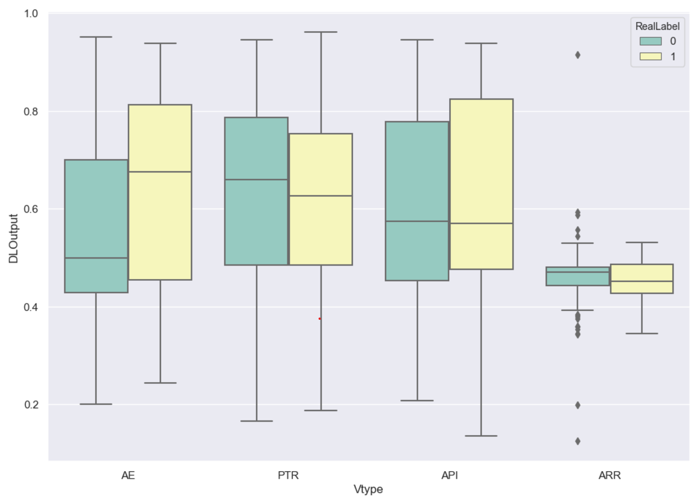
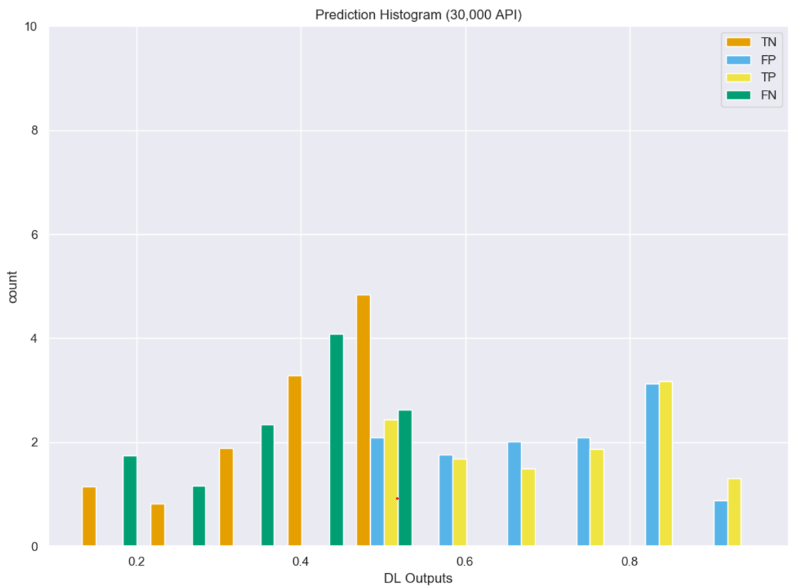
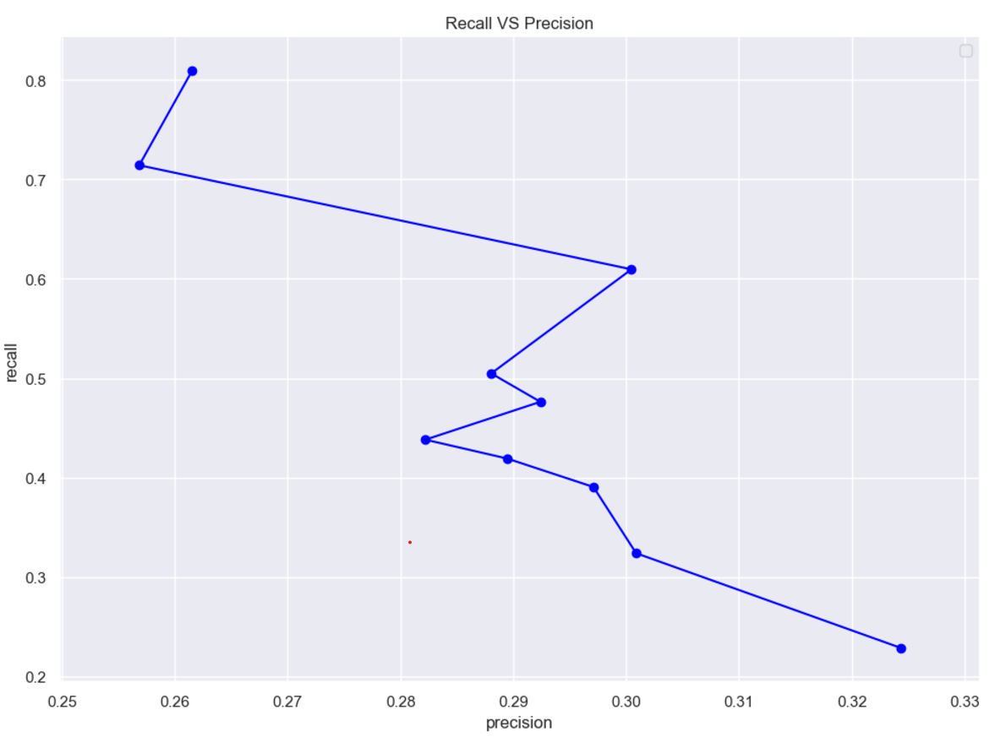
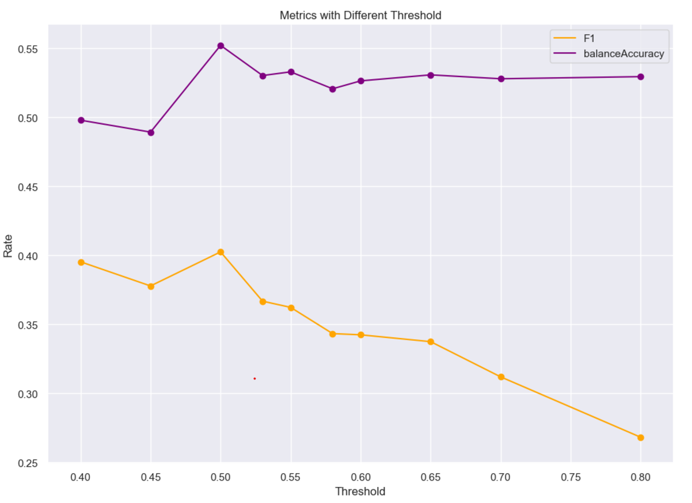
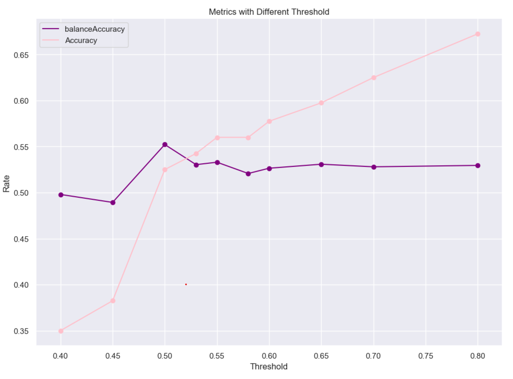
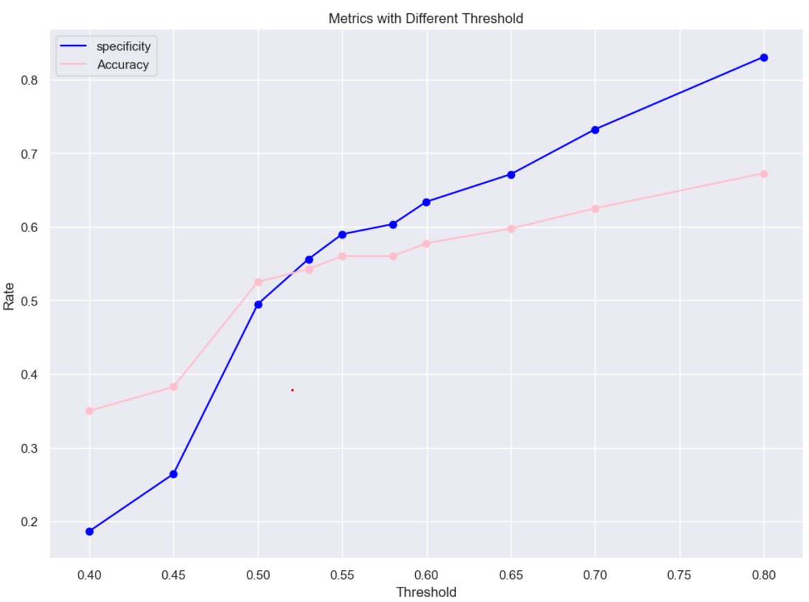

# Bidirectional Recurrent Neural Network with ADAM:
(Uses image-[1,6])

## Training:
```
Build model...
Model: "sequential_1"
_________________________________________________________________
Layer (type)                 Output Shape              Param #   
=================================================================
masking_1 (Masking)          (None, 131, 30)           0         
_________________________________________________________________
bidirectional_1 (Bidirection (None, 131, 512)          146944    
_________________________________________________________________
dropout_1 (Dropout)          (None, 131, 512)          0         
_________________________________________________________________
bidirectional_2 (Bidirection (None, 512)               1181184   
_________________________________________________________________
dropout_2 (Dropout)          (None, 512)               0         
_________________________________________________________________
dense_1 (Dense)              (None, 1)                 513       
=================================================================
Total params: 1,328,641
Trainable params: 1,328,641
Non-trainable params: 0
_________________________________________________________________
Fit model with Trainning set...
DL_Final_balancedClassTrain.pkl
368 368
start
Epoch 1/10
11/11 [==============================] - 10s 908ms/step - loss: 0.8533 - accuracy: 0.4830
Epoch 2/10
11/11 [==============================] - 8s 688ms/step - loss: 0.7092 - accuracy: 0.5369
Epoch 3/10
11/11 [==============================] - 8s 754ms/step - loss: 0.6869 - accuracy: 0.5909
Epoch 4/10
11/11 [==============================] - 8s 696ms/step - loss: 0.6774 - accuracy: 0.6080
Epoch 5/10
11/11 [==============================] - 8s 740ms/step - loss: 0.7111 - accuracy: 0.5284
Epoch 6/10
11/11 [==============================] - 8s 745ms/step - loss: 0.7219 - accuracy: 0.5653
Epoch 7/10
11/11 [==============================] - 8s 745ms/step - loss: 0.7000 - accuracy: 0.5483
Epoch 8/10
11/11 [==============================] - 8s 740ms/step - loss: 0.7782 - accuracy: 0.5028
Epoch 9/10
11/11 [==============================] - 8s 706ms/step - loss: 0.8194 - accuracy: 0.4830
Epoch 10/10
11/11 [==============================] - 8s 738ms/step - loss: 0.7733 - accuracy: 0.5284
```


## Model Predicitions:
```
Build model...
Model: "sequential_3"
_________________________________________________________________
Layer (type)                 Output Shape              Param #   
=================================================================
masking_3 (Masking)          (None, 131, 30)           0         
_________________________________________________________________
bidirectional_5 (Bidirection (None, 131, 512)          146944    
_________________________________________________________________
dropout_4 (Dropout)          (None, 131, 512)          0         
_________________________________________________________________
bidirectional_6 (Bidirection (None, 512)               1181184   
_________________________________________________________________
dropout_5 (Dropout)          (None, 512)               0         
_________________________________________________________________
dense_3 (Dense)              (None, 1)                 513       
=================================================================
Total params: 1,328,641
Trainable params: 1,328,641
Non-trainable params: 0
_________________________________________________________________
[0.560071, 0.7271531, 0.6064333, 0.51279163, 0.7517774, 0.20042418, 0.6776182, 0.83070034, 0.48296615, 0.6167989]
predicted array shape:  (400, 1)
new real label array shape:  (400, 1)
```


## Confusion Matrix:
```
Predicted Class
Total Samples 400.0
| Type     |   Positive |   Negative |
|----------+------------+------------|
| Positive |         64 |         41 |
| Negative |        149 |        146 |

Predicted Class
╒══════════╤════════════════════╤════════════════════╤════════════════════╤═════════════╕
│          │ Positive           │ Negative           │ Rate               │             │
╞══════════╪════════════════════╪════════════════════╪════════════════════╪═════════════╡
│ Positive │ 64.0               │ 41.0               │ 0.6095238327980042 │ Sensitivity │
├──────────┼────────────────────┼────────────────────┼────────────────────┼─────────────┤
│ Negative │ 149.0              │ 146.0              │ 0.494915246963501  │ specificity │
├──────────┼────────────────────┼────────────────────┼────────────────────┼─────────────┤
│          │ 0.3004694879055023 │ 0.7807486653327942 │ 0.5249999761581421 │ Accuracy    │
├──────────┼────────────────────┼────────────────────┼────────────────────┼─────────────┤
│          │ Precision          │ NegPrediction      │                    │             │
╘══════════╧════════════════════╧════════════════════╧════════════════════╧═════════════╛
```


## Graphed Outputs:
### Distribution per CVE type


### Prediction distribution


### Recall Vs. Precision


### Accuracy Vs. F1 score


### Balanced Accuracy Vs. Accuracy


### Specificity Vs. Accuracy
